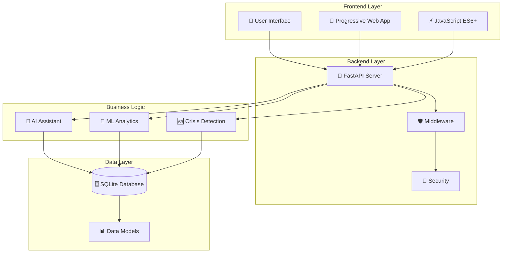
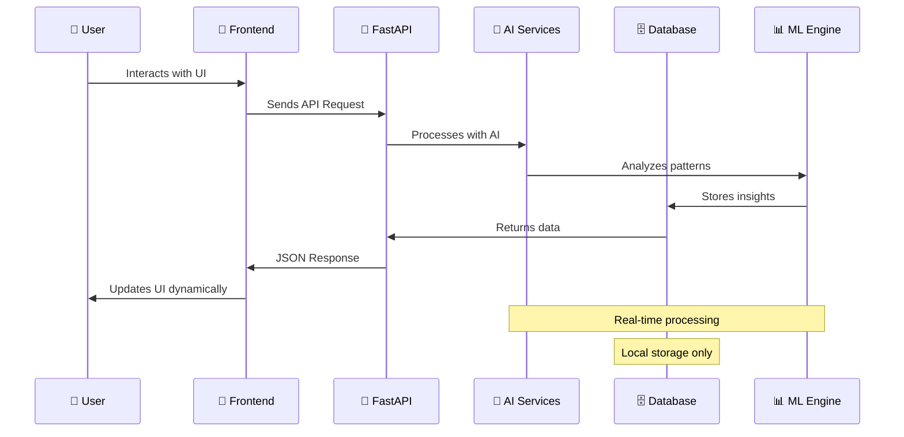
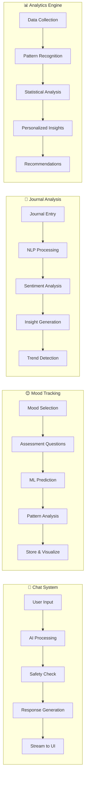
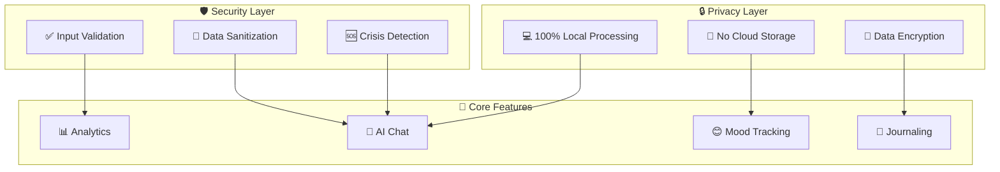

# 🧠 YuVA Wellness - AI-Powered Mental Health Companion

<div align="center">

[](https://python.org)
[](https://fastapi.tiangolo.com)
[](https://sqlite.org)
[](LICENSE)
[](#)
[](#)

> **🌟 Your personal AI companion for mental wellness. Chat, track, analyze, and grow - all while keeping your data completely private.**

[🚀 Quick Start](#-quick-start) • [🛠️ Tech Stack](#️-tech-stack) • [🔄 Workflow](#-project-workflow) • [🆘 Crisis Support](#-crisis-support)

</div>

---

## 🌟 What You'll Discover

YuVA Wellness isn't just another mental health app. It's your private, AI-powered companion that understands, learns, and grows with you on your wellness journey.

### 🏠 **Welcome Home**


Your journey begins here. A clean, welcoming interface that feels like a warm hug. But there's so much more beneath the surface...

---

### 💬 **AI Chat That Actually Gets You**


Ever wished you could talk to someone who truly understands mental health? Our AI doesn't just respond - it listens, remembers, and provides real support when you need it most.

**What makes it special:**
- Real-time streaming conversations
- Crisis detection and immediate help
- Remembers your journey
- Available 24/7, completely private

---

### 🧠 **Your Personal AI Dashboard**


Imagine having a personal wellness coach who knows exactly what you need, when you need it. Your dashboard adapts to you, not the other way around.

**Discover:**
- Personalized daily insights
- Interactive mindfulness sessions
- Smart wellness recommendations
- Progress tracking that motivates

---

### 📝 **Smart Journaling Experience**


Transform your thoughts into insights. Our intelligent journaling system doesn't just store your entries - it understands them, analyzes patterns, and helps you grow.

**Experience:**
- Beautiful, distraction-free writing
- AI-powered sentiment analysis
- Pattern recognition in your thoughts
- Complete privacy - your words stay yours

---

### 😊 **Mood Tracking Reimagined**


Forget boring mood logs. Track your emotional journey with our intuitive system that makes mood logging feel natural and insightful.

**Discover:**
- Quick emoji-based mood selection
- Comprehensive mood assessments
- Visual mood calendar
- Trend analysis that surprises you

---

### 📊 **Analytics That Tell Your Story**


Your mental health journey visualized like never before. Discover trends, celebrate progress, and get insights that actually help you grow.

**Uncover:**
- Mood patterns and triggers
- Wellness streaks and achievements
- Personalized recommendations
- Advanced pattern detection

---

### 🆘 **Crisis Support When It Matters Most**


Sometimes we all need immediate help. Access comprehensive crisis resources, helplines, and support - all formatted for when every second counts.

**Always available:**
- Emergency contacts for India and worldwide
- Mental health helplines
- Self-help strategies
- Professional resources

---

## 🚀 Quick Start

Ready to begin your wellness journey? It's easier than you think.

### 📥 **Get Started in 3 Steps**

```bash
# 1. Clone and enter
git clone https://github.com/MunishUpadhyay/YuVA-Wellness.git
cd YuVA-Wellness

# 2. Install dependencies
pip install -r requirements.txt

# 3. Launch your wellness companion
python run.py
```

**Windows users?** Just double-click `start_server.bat`

### 🌐 **Open Your Wellness Portal**
Visit **http://localhost:8000** and discover what makes YuVA special.

---

## 🛠️ **Tech Stack**

### **Backend**
- **Python 3.8+** - Core programming language
- **FastAPI** - Modern, fast web framework for building APIs
- **SQLite** - Lightweight database for local data storage
- **Uvicorn** - ASGI server for running the application

### **Frontend**
- **HTML5** - Semantic markup structure
- **CSS3** - Modern styling with custom properties and animations
- **JavaScript (ES6+)** - Interactive functionality and API communication
- **Progressive Web App (PWA)** - Offline capabilities and app-like experience

### **AI & Machine Learning**
- **Custom NLP Models** - For sentiment analysis and mood prediction
- **Pattern Recognition** - Advanced analytics for wellness insights
- **Real-time Processing** - Instant mood and journal analysis

### **Key Libraries**
- **Jinja2** - Template engine for dynamic HTML rendering
- **Python-multipart** - File upload handling
- **Starlette** - Web framework components

---

## 🔄 **Project Architecture & Workflow**

### **🏗️ System Architecture Overview**



### **📁 Project Structure**
```
🧠 YuVA-Wellness/
├── 🚀 app/                          # Core application
│   ├── 🎯 main.py                   # FastAPI entry point
│   ├── ⚙️ config.py                 # Configuration settings
│   ├── 🛡️ middleware.py             # Custom middleware
│   ├── 🔐 security.py               # Security utilities
│   │
│   ├── 📊 models/                   # Database layer
│   │   ├── 🗄️ db.py                # Database models & connection
│   │   └── 📝 __init__.py
│   │
│   ├── 🛣️ routers/                  # API endpoints
│   │   ├── 📖 journal.py            # Journal & analytics routes
│   │   └── 📝 __init__.py
│   │
│   ├── 🧠 services/                 # Business logic
│   │   ├── 🤖 ai_assistant.py       # AI chat functionality
│   │   ├── 💬 llm.py                # Language model integration
│   │   ├── 📈 ml_analytics.py       # Machine learning analytics
│   │   ├── 🆘 safety.py             # Crisis detection & safety
│   │   └── 📝 __init__.py
│   │
│   ├── 🎨 templates/                # HTML templates
│   │   ├── 🏠 index.html            # Homepage
│   │   ├── 💬 chat.html             # AI chat interface
│   │   ├── 📖 journal.html          # Journaling page
│   │   ├── 😊 mood.html             # Mood tracking
│   │   ├── 📊 analytics.html        # Analytics dashboard
│   │   ├── 🧠 ai_dashboard.html     # AI dashboard
│   │   ├── 🆘 resources.html        # Crisis resources
│   │   └── 🎯 base.html             # Base template
│   │
│   ├── 🎭 static/                   # Static assets
│   │   ├── 🎨 styles.css            # Main stylesheet
│   │   ├── ⚡ ui-enhancements.js    # UI interactions
│   │   ├── 🔊 chat-sounds.js        # Audio feedback
│   │   ├── 📱 sw.js                 # Service worker (PWA)
│   │   └── 📋 manifest.json         # PWA manifest
│   │
│   └── 🧩 components/               # Reusable components
│       ├── 🔧 shared/               # Shared utilities
│       ├── 📊 analytics/            # Analytics components
│       ├── 💬 chat/                 # Chat components
│       ├── 🎛️ dashboard/            # Dashboard components
│       ├── 🏠 home/                 # Homepage components
│       ├── 📖 journal/              # Journal components
│       └── 😊 mood/                 # Mood tracking components
│
├── 📦 requirements.txt              # Python dependencies
├── 🧠 requirements-ml.txt           # ML-specific dependencies
├── 🚀 run.py                       # Application runner
├── 🪟 start_server.bat             # Windows startup script
└── 🗄️ yuva.db                      # SQLite database
```

### **🔄 Data Flow Architecture**



### **🎯 Feature Implementation Flow**



### **🛡️ Security & Privacy Architecture**



### **⚡ Performance & Scalability**

- **🚀 FastAPI**: Async/await for high performance
- **📱 PWA**: Offline-first architecture
- **🗄️ SQLite**: Lightweight, serverless database
- **⚡ JavaScript**: Modern ES6+ for optimal performance
- **🎨 CSS**: Custom properties for efficient styling
- **🧠 AI**: Optimized models for real-time processing

---

## 🔒 Privacy Promise

**Your data never leaves your device.** No cloud storage, no tracking, no sharing. Just you and your private AI companion.

- ✅ **100% Local** - Everything runs on your computer
- ✅ **No Accounts** - No registration, no personal info required
- ✅ **No Tracking** - Your privacy is sacred
- ✅ **Open Source** - See exactly how it works

---

## 🆘 Crisis Support

**If you're in crisis, you're not alone:**

### 🇮🇳 **India**
- **Emergency**: 112 | **KIRAN**: 1800-599-0019 | **Sneha**: 044-24640050

### 🌍 **International**
- **US**: 988 | **UK**: 116 123 | **Australia**: 13 11 14

*YuVA Wellness supports your journey but isn't a replacement for professional care.*

---

## 🤝 Join the Journey

Found a bug? Have an idea? Want to contribute to mental health tech?

**We'd love your help:**
- 🐛 [Report Issues](https://github.com/MunishUpadhyay/YuVA-Wellness/issues)
- 💡 [Suggest Features](https://github.com/MunishUpadhyay/YuVA-Wellness/discussions)
- 🔧 [Contribute Code](https://github.com/MunishUpadhyay/YuVA-Wellness/pulls)

---

## 📄 License

MIT License - Use it, modify it, share it. Mental health support should be accessible to everyone.

---

<div align="center">

## 💝 Your Mental Health Matters

**Ready to discover what YuVA Wellness can do for you?**

[🚀 **Start Your Journey**](http://localhost:8000) • [💬 **Chat Now**](http://localhost:8000/chat) • [🧠 **Explore Dashboard**](http://localhost:8000/dashboard)

*Made with ❤️ for your wellbeing*

---

**⭐ Star this repo if YuVA Wellness helps you on your journey!**

</div>